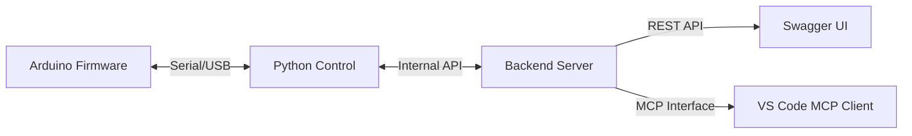

# Arduino LED Control with MCP Interface

This project demonstrates controlling an Arduino LED through a serial connection using Python, with both a REST API and Model Context Protocol (MCP) interface.

## System Architecture



## Components

1. **Arduino Firmware** (`serial_led_control/serial_led_control.ino`)
   - Simple firmware that listens for serial commands
   - Controls an onboard LED
   - Responds to ON/OFF commands
   - Reports current LED status

2. **Python Control** (`python_control/`)
   - Serial communication interface with Arduino
   - Handles command translation and status queries
   - Provides a Python API for LED control
   - Includes unit tests

3. **Backend Server** (`backend/`)
   - FastAPI-based HTTP server
   - Exposes REST API endpoints
   - Implements MCP interface for natural language control
   - Bridges between HTTP/MCP and the Python control layer

## Setup Instructions

### 1. Arduino Setup
1. Open `serial_led_control/serial_led_control.ino` in Arduino IDE
2. Upload the sketch to your Arduino board
3. Note the USB port (COM port) where Arduino is connected
   - Windows: Check Device Manager under "Ports (COM & LPT)"
   - The COM port may change when you reconnect the device

### 2. Python Control Setup
1. Navigate to the python_control directory:
   ```powershell
   cd python_control
   ```
2. Install dependencies:
   ```powershell
   pip install -r requirements.txt
   ```
3. Run tests (ensure Arduino is connected but backend is not running):
   ```powershell
   pytest test_serial_control.py
   ```

### 3. Backend Setup
1. Navigate to the backend directory:
   ```powershell
   cd backend
   ```
2. Install dependencies:
   ```powershell
   pip install -r requirements.txt
   ```
3. Start the server:
   ```powershell
   python start.py
   ```

The server will start with:
- MCP endpoint at: http://localhost:9000/mcp
- Swagger UI at: http://localhost:9000/docs

### 4. VS Code MCP Client Setup
1. Open VS Code
2. Configure the MCP connection using `.vscode/mcp.json`:
   ```json
   {
       "servers": {
           "arduino-mcp": {
               "type": "sse",
               "url": "http://localhost:9000/mcp"
           }
       }
   }
   ```

## Usage

1. Ensure all components are running:
   - Arduino is connected via USB
   - Backend server is running
   - VS Code is configured with MCP

2. Test via Swagger UI:
   - Open http://localhost:9000/docs in your browser
   - Try the LED control endpoints

3. Use MCP in VS Code:
   - Open VS Code command palette
   - Type natural language commands like:
     - "Please switch the led on"
     - "Turn the LED off"
     - "What's the LED status?"

## Troubleshooting

- If tests fail, ensure:
  - Arduino is properly connected
  - Correct COM port is being used
  - Backend server is not running (it would block the COM port)
- If MCP commands fail:
  - Check if backend server is running
  - Verify MCP configuration in VS Code
  - Ensure Arduino is connected to the correct COM port
